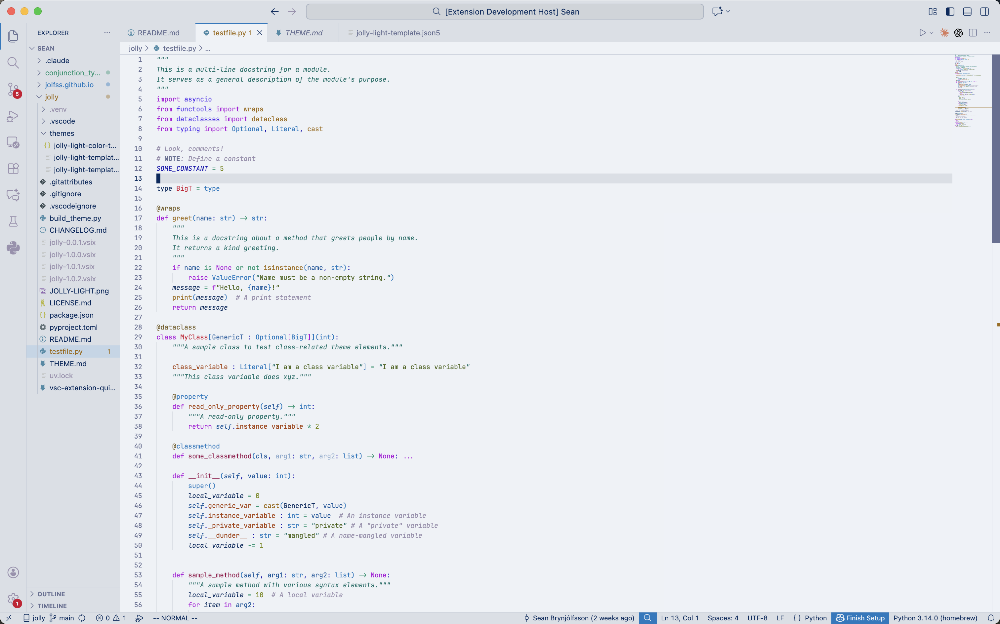

# jolly-light

A vibrant light theme for VSCode inspired by volcanoes, glaciers, and the northern lights. If your code starts to feel too hot, add some types or modularize to cool it down :-)



## Building the Theme

This theme uses a simple build system to manage color variables in a template.

The source theme is in [themes/jolly-light-template.json5](themes/jolly-light-template.json5), which supports:
- Color variables (defined in the `variables` section, referenced later using `${variableName}` syntax in the main body)
- Comments are elided (using `//` syntax for json5)

To build the final theme:

```bash
npm run build
```

This generates [themes/jolly-light-color-theme.json](themes/jolly-light-color-theme.json) from the template.

### Making Edits

If you want to adapt the theme, an easy way to do so is to use `Ctrl(Cmd) + Shift + P` and then select `Debug: Start Debuggin`; this should allow edits to the `*-theme.json` to reflect immediately in the extension. To get changes to reflect you can use either:

```bash
npm run build # will write from the -template to the -theme
npm run watch # will propagate writes to the -template to the -theme for you
```

### Color Preprocess Example

```json5
{
  "variables": {
    "primaryBlue": "#0081da",
    "navyBlue": "#002a5e"
  },
  "colors": {
    "editor.background": "${backgroundWhite}",
    "editor.foreground": "${navyBlue}"
  }
}
```

## Creating/Packaging the Extension
```bash
npx vsce package  # produces the jolly-*.*.*.vsix vscode package
```

## Files

- [themes/jolly-light-template.json5](themes/jolly-light-template.json5) - **Edit this file** (source with variables)
- [themes/jolly-light-color-theme.json](themes/jolly-light-color-theme.json) - Generated theme (do not edit)
- [build_theme.py](build_theme.py) - Build script
- [pyproject.toml](pyproject.toml) - Python dependencies (json5)


## License

Creative Commons; CC-BY 4.0 - enjoy :)
